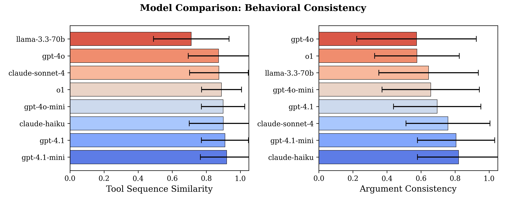
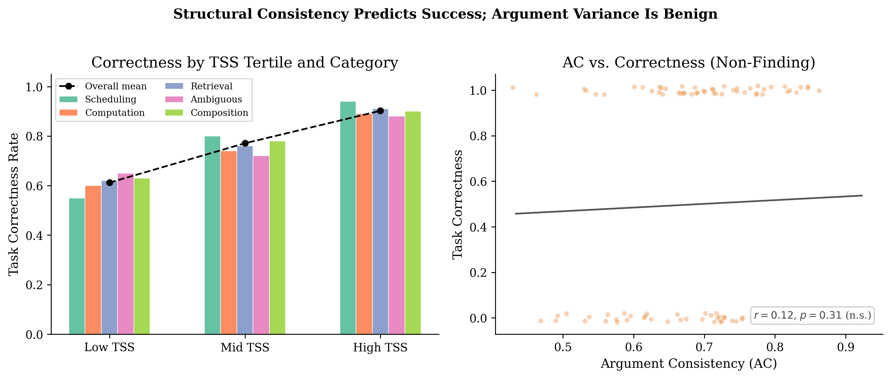
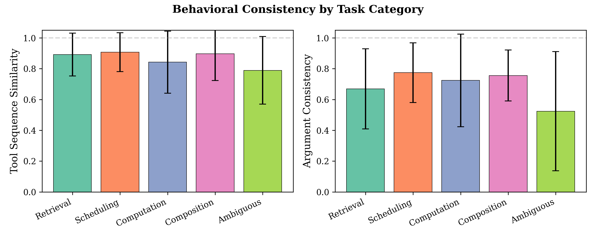
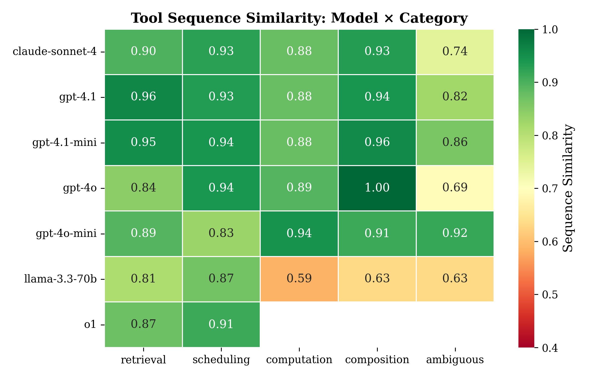
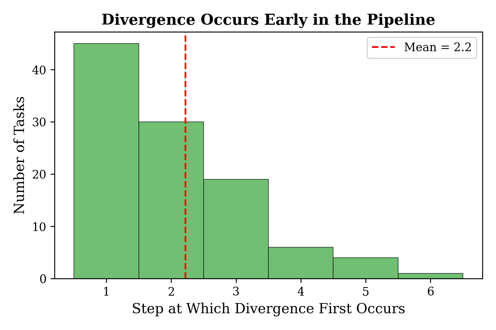

# 🔄 Agent Consistency

**How Consistent Are LLM Agents? Measuring Behavioral Reproducibility in Multi-Step Tool-Calling Pipelines**

[](paper/main.pdf)
[](LICENSE)

> When you give the same task to an LLM agent twice, does it behave the same way? We find a striking pattern: **agents reliably pick the same tools in the same order, but vary significantly in how they parameterize those calls**—and this structural consistency predicts whether the agent succeeds.

---

## 📊 Key Results

<p align="center">
  
</p>

| Finding | Result |
|---------|--------|
| Tool sequence similarity (TSS) | **0.87** mean across all models |
| Argument consistency (AC) | **0.69** mean — significantly lower (d=0.75, p<10⁻¹³) |
| Ambiguity reduces AC by | **28%** (d=0.74, p=0.001) |
| Divergence in first 2 steps | **60%** of all behavioral variance |
| Output exact match | **<5%** even when tool calls are identical |
| High-TSS → correctness | **90.2%** vs 61.2% for low-TSS (d=0.81) |

### The "Structural Consistency, Parametric Variance" Pattern

Agents learn robust *procedures*—the recipe for solving a task—but vary in *instantiation details* like search queries, date formats, and message phrasing. Crucially, this parametric variance is **benign**: it doesn't hurt task success (r=0.12, n.s.). Structural variance is where failures concentrate.

<p align="center">
  
</p>

---

## 🏗️ Benchmark Design

**19 tasks** across 5 categories of increasing ambiguity, evaluated with **10 deterministic simulated tools**:

| Category | Tasks | Description | Expected Consistency |
|----------|-------|-------------|---------------------|
| Data Retrieval | 4 | Contact lookups, email search, aggregation | High |
| Scheduling | 4 | Calendar events, conflict detection, free slots | High |
| Computation | 3 | Inventory calculations, revenue projections | High |
| Multi-Tool Composition | 4 | 3–5 tools in sequence (e.g., find email → lookup sender → schedule meeting) | Medium |
| Ambiguous | 4 | Intentionally underspecified (e.g., "prepare for my meetings tomorrow") | Low |

<p align="center">
  
  
</p>

All tools are **fully deterministic**—identical inputs always produce identical outputs. This isolates LLM variance from environment variance.

---

## 🤖 Models Evaluated

| Model | Provider | TSS | AC | Unique Sequences |
|-------|----------|-----|-----|-----------------|
| GPT-4.1-mini | OpenAI | **0.92** | **0.81** | 1.6 |
| GPT-4.1 | OpenAI | 0.91 | 0.69 | 1.6 |
| GPT-4o-mini | OpenAI | 0.90 | 0.66 | 1.8 |
| Claude Sonnet 4 | Anthropic | 0.88 | 0.76 | 2.2 |
| GPT-4o | OpenAI | 0.87 | 0.57 | 1.6 |
| Llama 3.3 70B | Meta/Together | 0.71 | 0.65 | **3.3** |

**6 models × 19 tasks × 10 runs = 1,140 agent traces** (+ partial o1 results on 7 tasks).

All runs at **temperature 1.0** (default deployment conditions).

---

## 📏 Metrics

- **Tool Sequence Similarity (TSS):** Mean pairwise normalized Levenshtein similarity over tool-name sequences. Ranges 0–1.
- **Argument Consistency (AC):** Mean pairwise Jaccard similarity over flattened key-value pairs at aligned step positions.
- **Unique Sequences:** Number of distinct tool-call sequences across N=10 runs.
- **Divergence Point:** Mean step index where traces first differ.
- **Output Agreement:** Exact-match rate of final natural language responses.

---

## 🔬 Practical Implications

1. **Reduce ambiguity in task specs** — strongest lever on consistency (stronger than model choice)
2. **Monitor early steps** — 60% of variance is in steps 1–2; a lightweight check catches most issues
3. **Test tool calls, not text** — assert on structured behavior, not natural language output
4. **Use TSS as a reliability proxy** — high structural consistency predicts task success without needing correctness labels

<p align="center">
  
</p>

---

## 🚀 Quick Start

```bash
# Clone and install
git clone https://github.com/Abelo9996/agent-consistency.git
cd agent-consistency
pip install -r requirements.txt

# Set up API keys
cp .env.example .env
# Edit .env with your OpenAI, Anthropic, and Together AI keys

# Run experiments
python -m src.runners.run_experiment --experiment exp1 --judges gpt-4o-mini gpt-4.1-mini

# Generate figures
python -m src.analysis.generate_figures
```

---

## 📁 Repository Structure

```
agent-consistency/
├── src/
│   ├── tasks/          # 19 task definitions with tool schemas
│   ├── agents/         # Agent runner (multi-provider tool-calling loop)
│   ├── metrics/        # TSS, AC, divergence point, output agreement
│   ├── runners/        # Experiment orchestration
│   ├── analysis/       # Figure generation
│   └── tools.py        # 10 deterministic simulated tools
├── configs/            # Experiment configuration (YAML)
├── figures/            # Generated figures (PDF + PNG)
├── paper/              # LaTeX source + compiled PDF
├── results/            # Raw trace data (gitignored)
├── requirements.txt
└── .env.example
```

---

## 📄 Citation

```bibtex
@article{yagubyan2026agentconsistency,
  title={How Consistent Are LLM Agents? Measuring Behavioral Reproducibility in Multi-Step Tool-Calling Pipelines},
  author={Yagubyan, Abel},
  year={2026},
  note={Preprint}
}
```

---

## 📜 License

MIT

---

*Part of a series on LLM evaluation reliability. See also: [Benchmark Saturation](https://github.com/Abelo9996/benchmark-saturation).*
